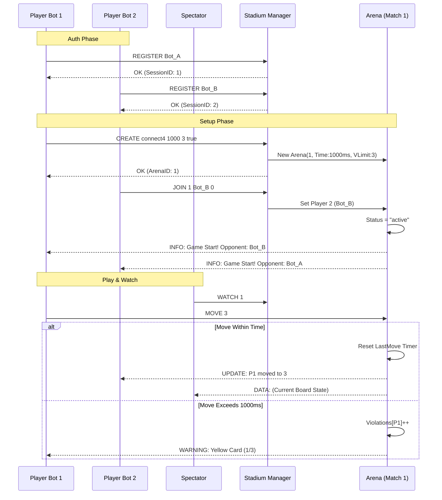

```mermaid
classDiagram
    class Session {
        +int SessionID
        +string BotName
        +bool IsRegistered
        +int PlayerID
        +Arena CurrentArena
        +net.Conn Conn
        +SendJSON(Response)
    }

    class Arena {
        +int ArenaID
        +string Status
        +Session Player1
        +Session Player2
        +List~Session~ Observers
        +GameInstance Game
        +Duration TimeLimit
        +int ViolationLimit
        +Map Violations
        +Time LastMove
        +NotifyAll(type, payload)
    }

    class Manager {
        +Map ActiveSessions
        +Map Arenas
        +int nextSessionID
        +RegisterSession(Session, name)
        +CreateArena(type, limit, vLimit, handicap)
        +JoinArena(id, Session, handicap)
        +startWatchdog()
    }

    Manager "1" *-- "*" Arena : manages
    Manager "1" *-- "*" Session : tracks
    Arena "1" o-- "2" Session : participants
    Arena "1" o-- "*" Session : observers
    Session "0..1" -- "0..1" Arena : linked to
