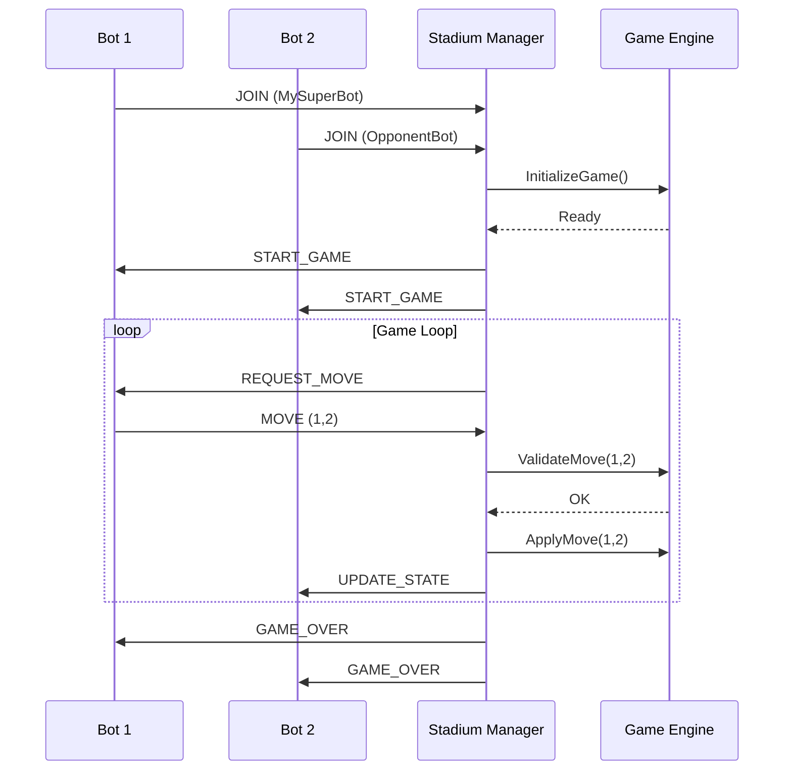

```mermaid
classDiagram
    class Session {
        +string BotName
        +net.Conn Conn
        +GameInstance CurrentGame
        +SendMessage(msg)
    }

    class GameInstance {
        <<interface>>
        +ValidateMove(move) bool
        +ApplyMove(move)
        +GetState() string
        +IsGameOver() bool
    }

    class Manager {
        +List~Session~ ActiveSessions
        +RegisterBot(Session)
        +StartMatch(Session, Session)
    }

    Manager "1" o-- "*" Session : manages
    Session --> GameInstance : plays    